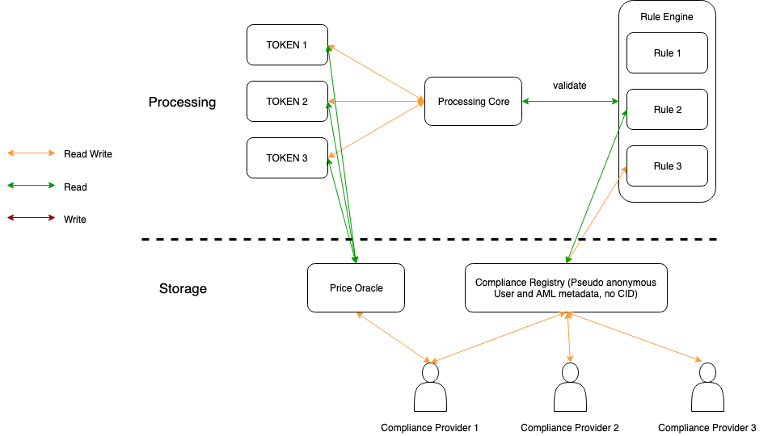
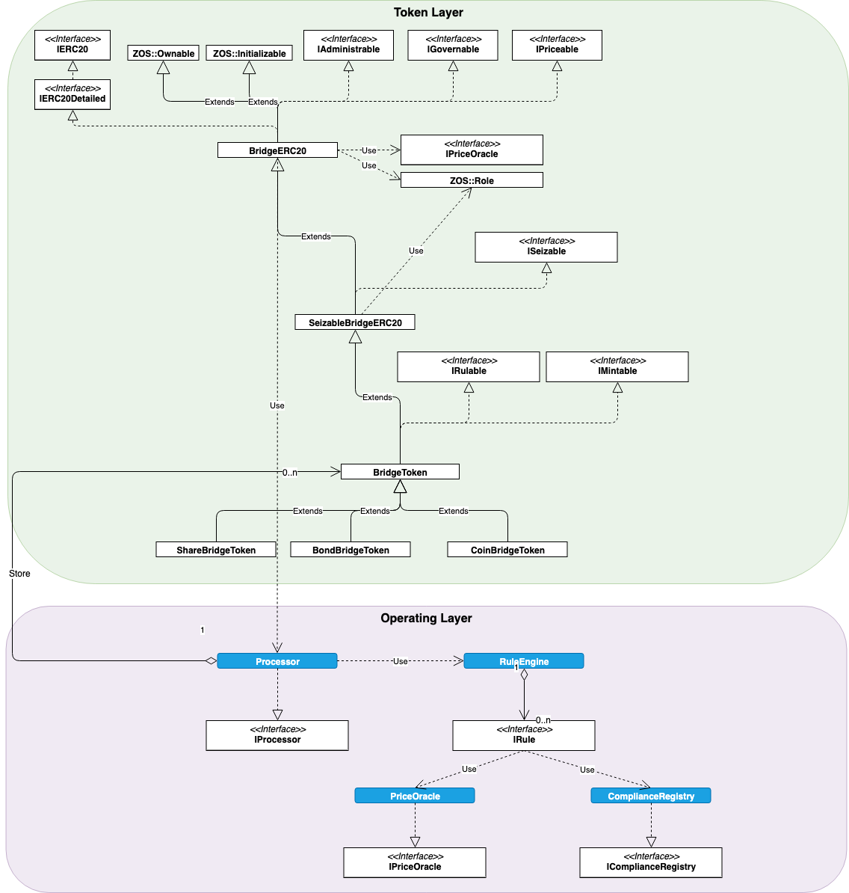

## Abstract

Bridge is an open source technology designed to issue and manage digital assets on the blockchain, i.e. security tokens (tokens that represent ownership of an underlying asset). Unlike utility tokens for which transfer is most of the time unrestricted, security tokens are subject to transferability restrictions based on many factors (identity, asset class, local rules, transfer history, etc.) coming from financial regulations.

Most of security token middlewares use a token-based approach to enforce such transfer restriction rules. This concept is a good step towards regulation, but lacks cross-token capabilities to apply rules that are computed accross multiple tokens (global transfer thresholds, for example). 

The purpose of Bridge is to provide a solution to this problem by being a cross-token compliance layer that will restrict the transferability of an ERC20 compliant token based on a set of rules. Those rules are managed by the issuer. who can set new rules whenever needed.

Moreover, for regulatory compliance, Bridge provides features that would allow authorities to transfer tokens from one address to another in case of exceptional events (loss of keys, legal constraints, locked assets, etc.).

## Audit

Contracts have been thoroughly audited by Chain Security: [Read the final report](https://chainsecurity.com/security-audit/mt-pelerin-bridge/)

## Overall overview

## Bridge Token

The token part is the interface used by external parties to interact with the token through all its lifecycle (issue/redeem, approvals, transfers, etc.). 

The token has a single owner, one or multiple administrators, one or multple issuers and one or multiple seizers.

As we want Bridge to be as open as possible, the token issuer will have the opportunity to define trusted intermediaries that will act as the compliance authorities for this specific token. The role of the compliance authority is to maintain the compliance registry and make sure that the information stored in the compliance registry are accurate.

The token is registered with a Processor that will process all the operations centrally. Having a single Processor for all tokens will ease the maintenance of the token lifecycle, as it will not be necessary to upgrade all the tokens to be able to add new features or new restrictions to each token.

Every token issued with Bridge Token is compliant with the following standard proposals:

- [ERC20](https://eips.ethereum.org/EIPS/eip-20)
- [ERC2612](https://eips.ethereum.org/EIPS/eip-2612)
- [ERC3009](https://eips.ethereum.org/EIPS/eip-3009)

[Bridge Token API Overview](docs/api.md#bridgetoken)

## Processor

The Processor orchestrates all operations on tokens. For each transfer, the Processor will apply the rules configured on the token level and available through the Rule Engine and check if every rule allows the transfer.

[Processor API Overview](docs/api.md#processor)

## Rule Engine

The Rule Engine is a library of rules that can be used by the token issuer to control how a token can be transfered or not. As regulations evolve, new rules can be added to the Rule Engine and the token issuer will be able to enforce them to adapt its compliance.

Trivial rules like maximum transfers or minimum transfers will not need to have interactions with other contracts. For more complex rules that need information about the identity linked to an address or the history of transfers linked to an address, two contract are currently provided: Compliance Registry and Price Oracle.

[Detailed Rule Engine Documentation](docs/RuleEngine.md)
[Rule Engine API Overview](docs/api.md#ruleengine)

## Compliance Registry

The Compliance Registry is responsible of the storage of all identity information linked to an address or the storage of the history of transfers linked to an address. The compliance registry is managed by trusted intermediaries. Each trusted intermediary has its own space within the registry to update its own address related information. Based on the token trusted intermediaries, the Compliance Registry will return the compliance information that have been updated by one of the token trusted intermediary.

> The Compliance Registry is designed to store only pseudo-anonymised data (no Customer Identification Data).

To be able to maintain a single reference currency for transfers history, the Compliance Registry will use the Price Oracle.

[Detailed Compliance Registry Documentation](docs/ComplianceRegistry.md)
[Compliance Registry API Overview](docs/api.md#complianceregistry)

## Price Oracle

The Price Oracle is responsible of providing exchange rates between the reference currency and the token price.

[Price Oracle API Overview](docs/api.md#priceoracle)

## Contract Diagram

## API

- [API](docs/api.md)
